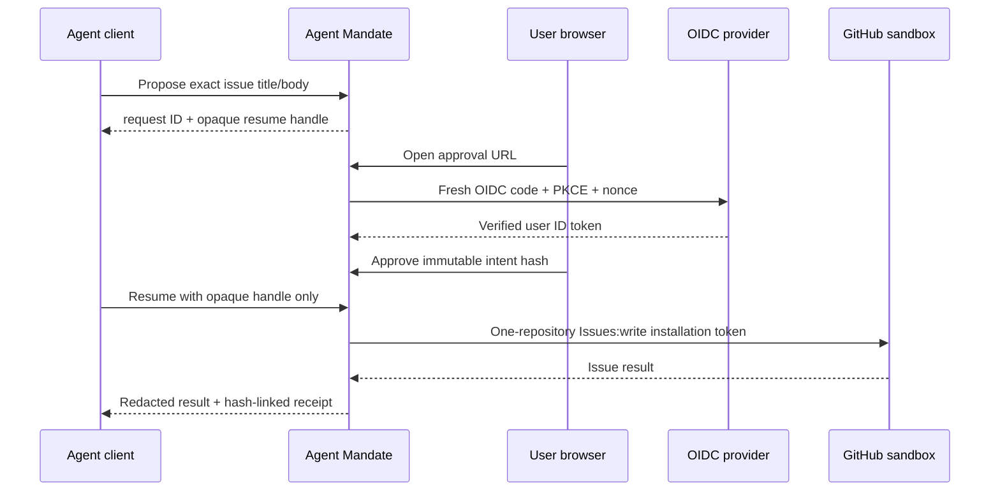

# Agent Mandate v0.2 self-hosted quickstart

This guide runs the unreleased v0.2 candidate against one GitHub sandbox
repository. It is a controlled evaluation path, not a production-readiness
claim. The frozen security contract is in
[`v0.2-product-contract.md`](v0.2-product-contract.md).

## What this proof does



The model never approves, chooses a connection or repository ID, restates the
approved arguments on resume, or receives the GitHub App private key or an
installation access token.

## Prerequisites

- Docker Compose v2.
- A disposable GitHub repository used only for this proof.
- A GitHub App installed on only that repository with repository permission
  **Issues: Read and write**. No organization or account permissions are needed.
- An OIDC/OAuth authorization server reachable by Agent Mandate and the client.
  Register `http://127.0.0.1:8787/oauth/callback` for a loopback evaluation, or
  the exact HTTPS equivalent for a deployed service.

Use a separate GitHub App and repository for the sandbox. Do not reuse a
production installation while the v0.2 gates remain open.

## OIDC contract

The MCP/API access token is a signed RS256 JWT. Agent Mandate verifies `iss`,
`aud`, `exp`, `iat`, and the configured JWKS before deriving any identity. It
also requires:

| Claim | Meaning |
| --- | --- |
| `sub` | human principal subject and default principal ID |
| `tenant_id` | exact configured tenant |
| `agent_id` | authenticated agent identity |
| `workload_id` | authenticated client/workload identity |
| `client_id` or `azp` | OAuth client binding |
| `scope` | must contain `agent-mandate:use` |

Token refresh may rotate `jti`; approval resume stays bound to the verified
issuer, subject, tenant, principal, agent, workload, and OAuth client.

The browser approval ID token is independently verified against the approval
OIDC issuer/client. It must contain `tenant_id`, `sub`, the login `nonce`, and a
fresh `auth_time`. Approval sessions expire after five minutes by default.
Configure the identity provider to include these claims; the service does not
accept identity fields from MCP arguments or request bodies.

## Configure the service

Copy the template and replace every placeholder:

```bash
cp .env.product.example .env.product
```

Generate the two 256-bit service keys independently. Keep the GitHub App private
key out of source control. For a deployment, prefer the supported
`INTERNAL_GRANT_KEY_FILE`, `APPROVAL_COOKIE_KEY_FILE`, and
`GITHUB_APP_PRIVATE_KEY_FILE` variables backed by your secret manager instead
of inline values. Setting both an inline variable and its `_FILE` counterpart is
rejected.

`GITHUB_REPOSITORY_ID` is GitHub's immutable numeric repository ID, not its
name. An operator can read it with:

```bash
gh api repos/OWNER/REPOSITORY --jq .id
```

The configured name and numeric ID are stored as one trusted resource mapping.
Tool arguments can select only the connected display name; they cannot inject a
repository ID, GitHub installation, permission set, API origin, or route.

## Start and verify

```bash
docker compose -f compose.product.yml up -d --build --wait
curl --fail http://127.0.0.1:8787/healthz
curl --fail http://127.0.0.1:8787/readyz
```

The container applies both migrations under a PostgreSQL advisory lock before
starting the product listener. It runs non-root with a read-only filesystem,
dropped capabilities, bounded health checks, and a loopback-only published
port. Its startup log intentionally reports `"protection":"mediated"`.

Stop it with:

```bash
docker compose -f compose.product.yml down
```

Add `-v` only when you intentionally want to delete the local evidence database.

## Add it to an agent client

The target published command is:

```bash
npx -y @agent-mandate/cli@0.2.0 protect github \
  --endpoint https://your-agent-mandate.example/mcp
```

Until the package is published, run the same code from this repository:

```bash
npm run build:cli
node packages/cli/dist/main.js protect github \
  --endpoint http://127.0.0.1:8787/mcp
```

Use `--clients codex,claude,cursor,vscode,gemini` for an explicit subset,
`--scope project` only for clients whose native CLI safely supports it, and
`--dry-run` for a zero-write preview. The installer writes only the MCP URL. It
does not accept token, header, password, private-key, or GitHub credential
options.

Run the diagnostics after installation:

```bash
node packages/cli/dist/main.js doctor
```

`doctor` reports common bypass indicators without printing their values. A clean
scan is still `not_verified`, not proof of enforced deployment isolation.

## Run the live proof

Use a short-lived access token minted for the product audience and scope. The
script reads it only from the environment, rejects redirects, bounds every
response, and never prints it:

```bash
AGENT_MANDATE_URL=http://127.0.0.1:8787 \
AGENT_MANDATE_ACCESS_TOKEN='short-lived-access-token' \
GITHUB_REPOSITORY=OWNER/REPOSITORY \
npm run demo:github
```

The proof performs these checks in order:

1. Sends a prompt-injection-shaped request containing repository-delete
   authority and requires an `invalid_request` denial before any approval is
   created.
2. Proposes the exact issue and prints its approval URL and intent hash. The
   opaque resume handle remains in process memory and is not printed.
3. Polls only the read-only approval status while a user signs in and approves.
4. Calls resume exactly once. If that response is lost, the script reports an
   ambiguous outcome and does not retry the write.
5. Prints the allowlisted GitHub issue result and requires the persisted receipt
   chain to verify.

This proves deterministic prevention of unauthorized action drift. It does not
prove that the prompt was detected, that every direct credential path has been
removed, or that the deployment is production ready.

## From mediated to enforced

Before claiming protection rather than mediation, validate all of the following
for the exact deployment:

- GitHub credentials and authenticated `gh`, Git, SSH, alternate GitHub MCP, and
  direct API paths are absent from the agent boundary.
- Provider-mutation egress is allowed only from Agent Mandate.
- The GitHub App is installed only on intended repositories and retains only
  the reviewed permission set.
- PostgreSQL uses TLS, backups, point-in-time recovery, monitored failover, and
  an evidence-retention policy.
- Service keys and the GitHub private key come from a secret manager and rotate
  through a tested procedure.
- Exact-candidate concurrency, crash, outage, saturation, soak, live-client, and
  live-provider gates in the v0.2 contract have passed.
- An external security reviewer and the pilot owner have accepted the boundary.

Until then, describe the system as a strong, controlled implementation candidate
for a sandbox evaluation.
